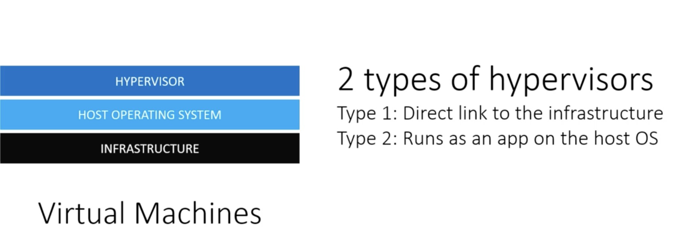
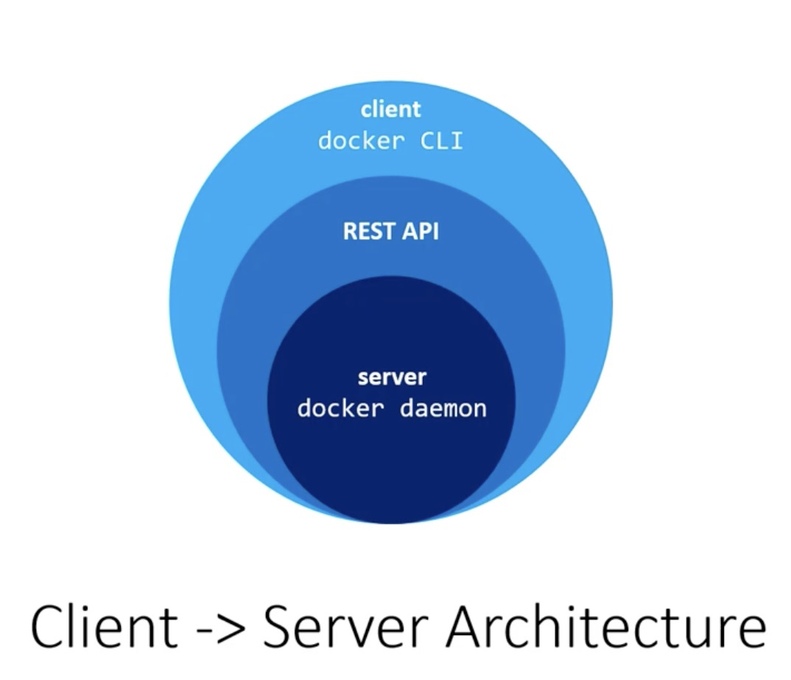

# Basics of Docker Training

## Understanding Docker
- Virtual machine vs Docker
    - Docker containers are not VMs!
    - Docker Daemon runs on Linux VM

### Virtual Machine Layout

- VMs use Hypervisor that to run VM file
- There are two types of hypervisors

- Hypervisor sits on top of the host OS
- Guest Operating Systems sit on top of the Hypervisor, and run they apps


### Docker Layout


- Docker Daemon runs the images
- No need for Guest OS in docker
- Docker is not a replacement for VMs
    - VMs are like houses: independent infrastructure
    - Docker containers are like apartments: shared infrastructure
- VM use cases:
    - testing the system as a whole
    - in the web hosting, you might separate vm per client
- Docker use cases:
    - Think of it like package manager for applications
- VMs isolates systems, Docker isolates applications
- Often VMs and Docker are used together


## Docker Architecture

Docker is like Client -> Server Architecture



Docker Daemon runs from docker host (a vm that runs linux)


## Discovering Docker

- Docker Image is like a "class", docker container is like an "object" (in reference to OOP)
- containers are immutable
    - changes persist only while contaienr is running
    - two containers from the same image are separate instances of that image
- Docker registry
    - repository of images
    - tags are how images are versioned


- Docker hub is like gihub for docker images
- try to use official images
- for non-official images
    - you have build settings for CI/CD
    - name spaced to username
- Docker build process
    - no need to use commit command for building images
    - best use dockerfile, dockerfile is like a dependency list. Similar to package.json or requirements.txt
- Images are build with layers of images
    - `From {imageName}` is used to build on previous images, like inheritance
- Docker caches previous work, so it only rebuilds instructions that have changed
    - so copy and install requirements first, then copy everything else.
- CMD commands are ran when the image is ran

### Docker Commands
- Commands are categorized
    - image is for image management
    - container is for container management
    - etc
- image management commands
    - ls  → to list images
    - tag source dest → to tag images
    - push/pull → to sync with docker hub
    - rm -f first 4 digits of hash. → force delete local image
    - inspect → json of image data
    - build -t tagName . → build image from current directory and tag it

## Running Docker Container

### Commands and Flags

- -it flags (i and t)
    - i for interactive
    - t for allocate a psudo-TTY (not sure what it is right now)
    - the gist of these flags is that it will drop you into the interactive terminal session of that container
- -p 5000:5000 (Expose port : Match to APP port)
    - giving just the app port ie. 5000 will have docker chose an available port to expose
- stats → return live data stream of running containers
- —rm → deletes container after it is stopped
- —name → names container
- stop → stops container
- —restart on-failure → restarts container if crashed
- -d → detached mode

### Linking Containers With Docker Networks

1. build images
2. create network 
    1. CMD: `docker network create --driver bridge firstnetwork`
    2. if not created then docker will use default network
3. run images with —net flag passing network name
    1. CMD: 
    ```bash
    docker container run --rm -itd -p 6379:6379 --name redis 
     --net firstnetwork redis:3.2-alpine
    ```
    

We can inspect networks with inspect command

`docker network inspect networkname`

### Persisting Data to Your Docker Host

The gist is to store data on the host in a volume. Get the right volume path by checking the db’s docs on docker hub

Create Volume: `docker volume create web2_redis`

Use Volume: 

```
docker container run --rm -itd -p 6379:6379 --name redis \
  --net firstnetwork -v web2_redis:/data redis:3.2-alpine
```

### Share Data Between Containers

make sure the container are on the same host

add volumes instruction in the dockerfile 

### Optimizing Scripts

use dockerignore

further optimization is to delete build dependencies

### Running Scripts When a Container Starts

Docker ENTRYPOINT

CMD instructions are arguments to ENTRYPOINT

We can use to change different configs per image

# Docker Compose

Compose is used to run and build multiple containers

- Version: ‘3’
    - docker compose api has multiple versions
- yaml
    - is space sensitive
    - lists start with a dash
- COMPOSE_PROJECT_NAME to name the project
    - if not provided, docker will name space the project based on the folder name
- compose v3 and v2 are very similar, v1 is legacy try to avoid

## Dockerizing Your Web Apps

### General tips

- Log to STDOUT
- Use ENV variables.
    - also separate env files per enviroment
- Keep apps stateless, use Redis.

https://12factor.net/
