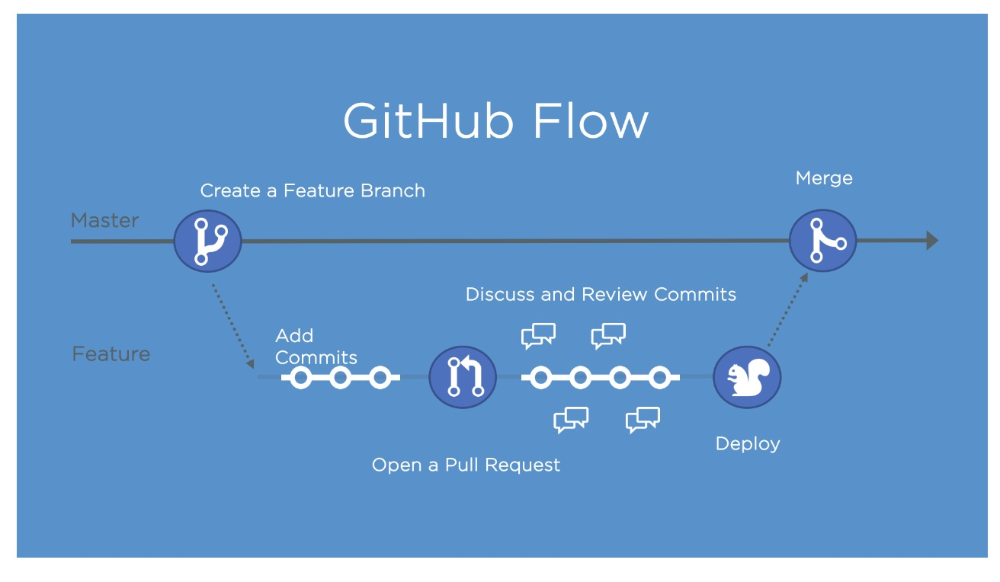

# Release Based Workflow

[Completed Training Repo Link](https://github.com/SmileNP/skills-release-based-workflow)

## GitHub Flow

## Release management

There are several strategies for managing releases. Some teams might use long-lived branches, like `production`, `dev`, and `main`. Some teams use simple feature branches, releasing from the main branch.

Release branches can and should be set up as protected.

You should open a pull request between your release branch and main as early as possible. It might be open for a long time, and that's okay.

In general, the pull request description can include:

- A [reference to an issue](https://docs.github.com/en/articles/basic-writing-and-formatting-syntax/#mentioning-people-and-teams) that the pull request addresses.
- A description of the changes proposed in the pull request.
- [@mentions](https://docs.github.com/en/articles/basic-writing-and-formatting-syntax/#mentioning-people-and-teams) of the person or team responsible for reviewing proposed changes.

## Automatically generated release notes

[Automatically generated release notes](https://docs.github.com/en/repositories/releasing-projects-on-github/automatically-generated-release-notes) provide an automated alternative to manually writing release notes for your GitHub releases. With automatically generated release notes, you can quickly generate an overview of the contents of a release. Automatically generated release notes include a list of merged pull requests, a list of contributors to the release, and a link to a full change log. You can also customize your release notes once they are generated.

## Semantic versioning

Semantic versioning is a formal convention for specifying compatibility. It uses a three-part version number: **major version**; **minor version**; and **patch**. Version numbers convey meaning about the underlying code and what has been modified. For example, versioning could be handled as follows:

| Code status | Stage | Rule | Example version |
| --- | --- | --- | --- |
| First release | New product | Start with 1.0.0 | 1.0.0 |
| Backward compatible fix | Patch release | Increment the third digit | 1.0.1 |
| Backward compatible new feature | Minor release | Increment the middle digit and reset the last digit to zero | 1.1.0 |
| Breaking updates | Major release | Increment the first digit and reset the middle and last digits to zero | 2.0.0 |

Check out this article on [Semantic versioning](https://semver.org/) to learn more.